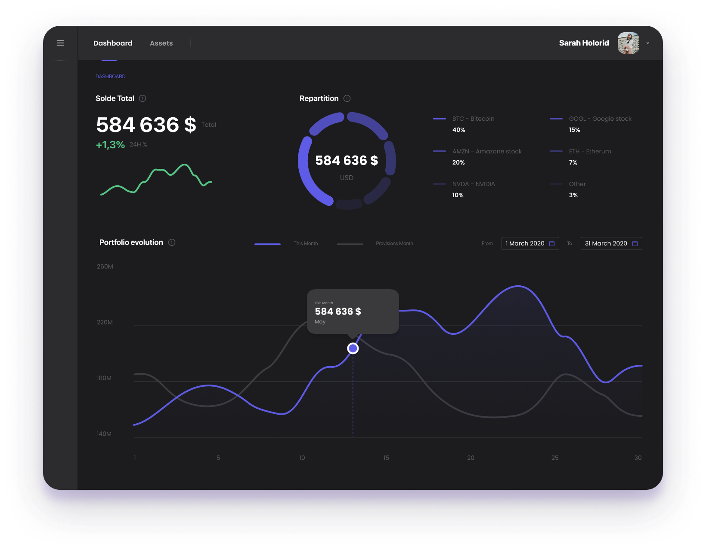
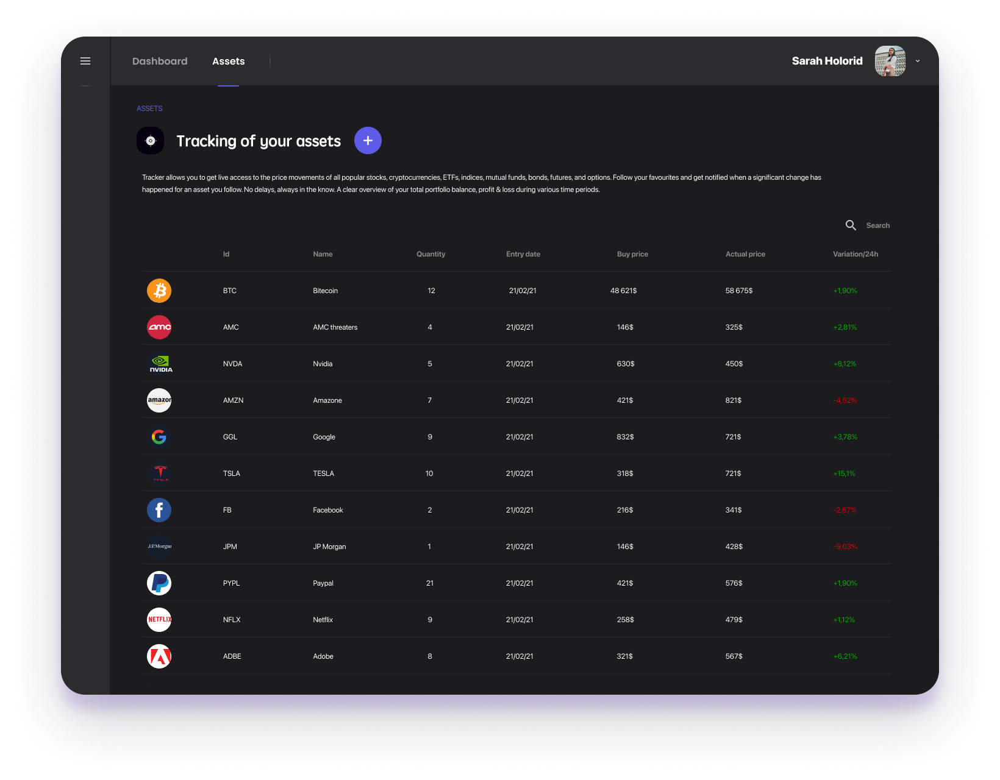
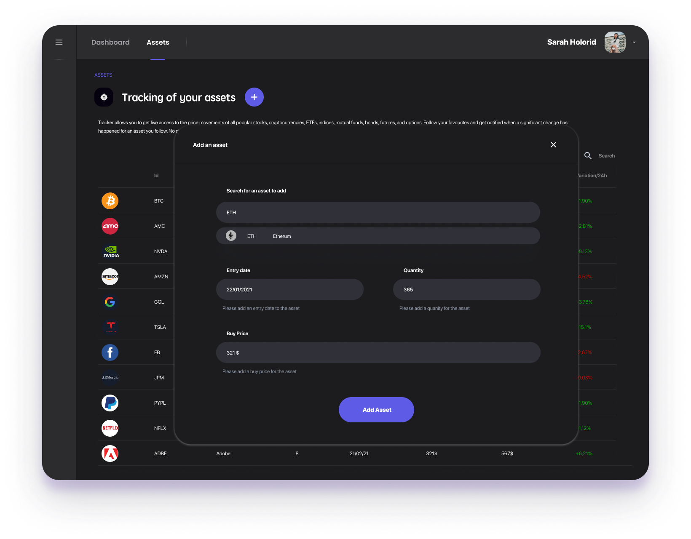
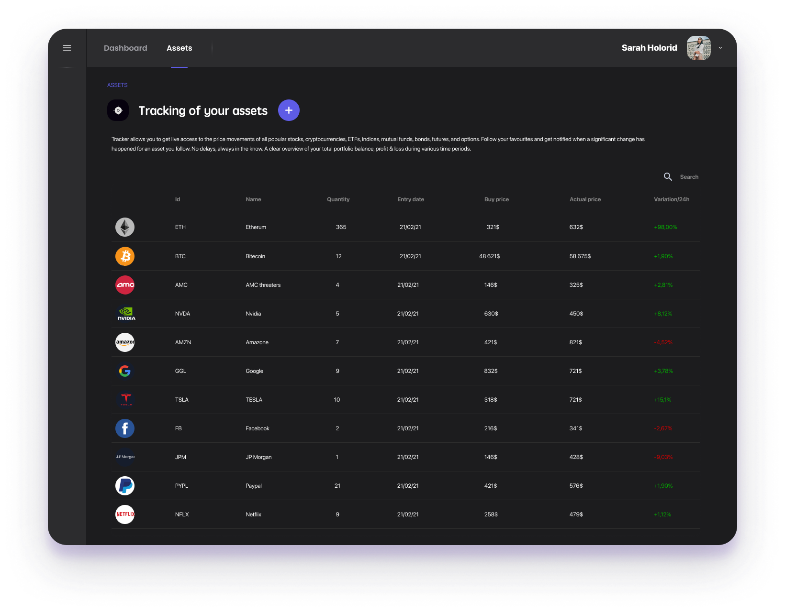

Assets app

## Page 1 - Dashboard

Le dashboard est une page de data visualisation permettant d’afficher le solde total, la répartition ainsi que l’évolution du portfolio.

## Page 2 - Assets

La navigation entre le dashboard  et les assets s’effectue via des tabs présentes en haute à gauche de l’écran.

Les Assets sont un tableau regroupant les différents actifs financiers ajoutés par l’utilisateur.

## Page 3 - Ajouter un asset

L’ajout d’un asset s’effectue via le bouton « + » situé à coté du titre « tracking your assets »

La Pop up d’ajout d’asset permet d’ajouter un actif financier en y inscrivant les informations suivantes:

- Nom de l’asset : Champ à auto complétion
- Date d’entrée : Champ « date picker »
- Quantité : Champ standard
- Prix d’achat :  Champ standard

## Page 4 - Assets

Il s’agit de la même page que la page 2 « Assets » avec l’actif qui a été ajouté via la page 3 « Ajouter un asset »

